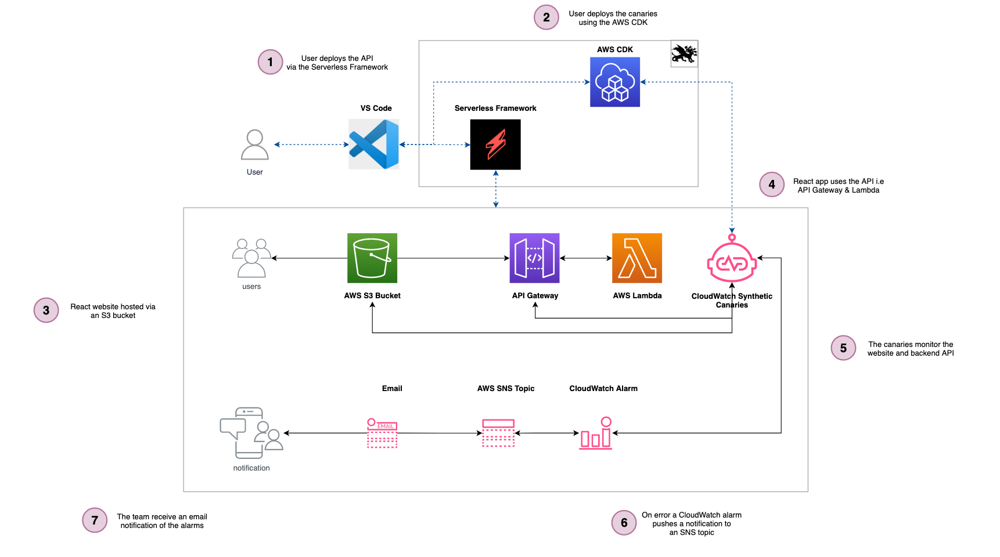

# serverless synthetics canaries

Practical example of using CloudWatch Synthetics Canaries to monitor your serverless applications, with visuals and corresponding code repo written in TypeScript and the Serverless Framework.

This is supporting the following blog post: [Serverless Synthetic Canaries 🚀](/)

## Introduction

Teams often require that their applications are constantly tested for failures in the same manner that their end users are using the system. This includes being alerted if the page is not displaying correctly for the user, or if the API supporting it is not working correctly.

CloudWatch Synthetic Canaries is a powerful of way of constantly ensuring that APIs are working correctly, that there are no broken links in their webpages, visual diff checks to make sure their websites are displaying correctly and heartbeat checks. CloudWatch Synthetics allows us to create the relevant monitoring, alerting, logging and storing of screenshots to ensuring everything is working as expected!

## Deploying

### Deploying the API ⚙️

Change directory into the `apps/api` folder and run `npm run deploy:develop` which will deploy the API Gateway to AWS.

> Note: Make a record of the API which is generated by the Serverless Framework, and paste the values into the config file apps/client/.env

> and also update the file infra/.env (you can only add the website url once the client is deployed)

### Deploying the client (website) 🖥️

In the folder `apps/client` run `npm run deploy:develop` which will deploy the React app to the S3 bucket for hosting.

### Deploying the Synthetic Canaries 🐦

Go into the `infra` folder and run `npm run deploy:develop` which will deploy the infrastructure using the AWS CDK

## Removing

Go into each of the folders as discussed above and run `npm run remove:develop`.

** The information provided are my own personal views and I accept no responsibility on the use of the information. \***
